# Get started with Casper

## 1. Create and deploy a simple smart contract

First I installed the Casper Crates with the following command:
```
cargo install cargo-casper
```
Then I created a new smart contract project:
```
cargo casper 1-smart-contract
```
I had trouble running the next commands at first, but I fixed them by updating them to the following:
```
cd contract
rustup install $(cat ../rust-toolchain)
rustup target add --toolchain $(cat ../rust-toolchain) wasm32-unknown-unknown
```
After that I built the contract:
```
cargo build --release
```
Time to test the contract. I changed directories:
```
cd ../tests
cargo test
```
But I was met with an error... which was alleviated by moving the `contract.wasm` in the `my-project/contract/target/wasm32-unknown-unknown/release` directory to `tests/wasm`. After alleviating that issue, I received this output:
```
    Finished test [unoptimized + debuginfo] target(s) in 0.15s
    Running unittests (target/debug/deps/integration_tests-4df7173c208773ee)

running 2 tests
test tests::should_error_on_missing_runtime_arg - should panic ... ok
test tests::should_store_hello_world ... ok

test result: ok. 2 passed; 0 failed; 0 ignored; 0 measured; 0 filtered out; finished in 0.06s
```
Now it was time to deploy the contract to the `casper-test` chain with this command:
```
casper-client put-deploy --chain-name casper-test --node-address http://5.189.180.23:7777 --secret-key secret_key.pem --session-path contract.wasm --payment-amount 10000000
```
Which gives us:
```
{
  "id": 4446077317592984888,
  "jsonrpc": "2.0",
  "result": {
    "api_version": "1.3.2",
    "deploy_hash": "2f2059cd575fc2101afeec76400bef246ae40d4e8abfef9a1b53b8f83e9d4d06"
  }
}
```
And we can check the deploy by using the `deploy_hash` and this command:
```
casper-client get-deploy --node-address http://5.189.180.23:7777 2f2059cd575fc2101afeec76400bef246ae40d4e8abfef9a1b53b8f83e9d4d06
```
Which returns:
```
{
  "id": 881476321864895088,
  "jsonrpc": "2.0",
  "result": {
    "api_version": "1.3.2",
    "deploy": {
      "approvals": [
        {
          "signature": "[130 hex chars]",
          "signer": "0167fe0ac42f1b367139a8331f2e6b788d1638972dc3fa776c88371f7a0a6bd777"
        }
      ],
      "hash": "2f2059cd575fc2101afeec76400bef246ae40d4e8abfef9a1b53b8f83e9d4d06",
      "header": {
        "account": "0167fe0ac42f1b367139a8331f2e6b788d1638972dc3fa776c88371f7a0a6bd777",
        "body_hash": "80b4413b7da54fbe3314e07bbe3d3f828524d9b2805aa02404e142d3697ee6e0",
        "chain_name": "casper-test",
        "dependencies": [],
        "gas_price": 1,
        "timestamp": "2021-09-16T01:02:08.979Z",
        "ttl": "30m"
      },
      "payment": {
        "ModuleBytes": {
          "args": [
            [
              "amount",
              {
                "bytes": "03809698",
                "cl_type": "U512",
                "parsed": "10000000"
              }
            ]
          ],
          "module_bytes": ""
        }
      },
      "session": {
        "ModuleBytes": {
          "args": [],
          "module_bytes": "[51990 hex chars]"
        }
      }
    },
    "execution_results": []
  }
}
```

## 2. Multi-Signature Tutorial

I began by cloning the example contract and client repository, and followed the steps to build the smart contract:

```
cd 2-keys-manager
rustup install $(cat rust-toolchain)
rustup target add --toolchain $(cat rust-toolchain) wasm32-unknown-unknown
cd contract
cargo build --release
```
We can then find the `keys-manager.wasm` file in the `contract/target/wasm32-unknown-unknown/release` directory.

After setting up the local Casper Network, I created the `.env` file and ran:
```
npm install
npm run start:atomic
```
Which resulted in the following steps:
```
0.1 Fund main account.
0.2 Install Keys Manager contract
1. Set faucet's weight to 3
2. Set Keys Management Threshold to 3
3. Set Deploy Threshold to 2.
4. Add first new key with weight 1.
5. Add second new key with weight 1.
6. Make a transfer from faucet using the new accounts.
7. Remove the first account
8. Remove the second account
```
That gives us:
```
Current state of the account:
{
  _accountHash: 'account-hash-ff89...',
  namedKeys: [
    {
      name: 'keys_manager',
      key: 'hash-ace3...'
    },
    {
      name: 'keys_manager_hash',
      key: 'uref-e088f...'
    }
  ],
  mainPurse: 'uref-12b3...',
  associatedKeys: [
    {
      accountHash: 'account-hash-ff89...',
      weight: 3
    }
  ],
  actionThresholds: { deployment: 2, keyManagement: 3 }
}
```

## 3. Additional Scenarios

I decided to go with **Scenario 4: managing lost or stolen keys** to demonstrate my understanding of key management concepts. Add the `scenario-lost.js` to your `client/src`, and update the `package.json` with the one provided in `3-lost-keys`. Run the script and view the results. The results should show in this order: 
```
1. Set mainAccount's weight to 3.
2. Set Keys Management Threshold to 3.
3. Set Deploy Threshold to 2.
4. Add browser key with weight 1.
5. Add mobile key with weight 1.
6. Make a transfer from mainAccount using the new accounts.
7. Remove the browser and mobile accounts.
8. Add new browser and mobile keys with mainAccount.
9. Make a transfer from faucet using the new accounts.
10. Attempt a transfer with the lost keys, results in an error.
```

### 4. Direct Toke Transfer
After following the prerequisites, I was able to set up an account that I could transfer CSPR to another account with this command:
```
casper-client transfer --id 1 --transfer-id 123456789012345 --node-address http://164.90.198.193:7777 --amount 2500000000 --payment-amount 1000 --secret-key secret_key.pem --chain-name casper-test --target-account 0148b69fa01d5b146493e154c453305825982eb87a103de7d0a3a7993dd18f3db1
```
Result:
```
{
  "id": 1,
  "jsonrpc": "2.0",
  "result": {
    "api_version": "1.3.2",
    "deploy_hash": "1a6eae3b906de144f2b10789e2139e468b74eba4e86d25cf89b1d2e95d013070"
  }
}
```
The successful transfer:
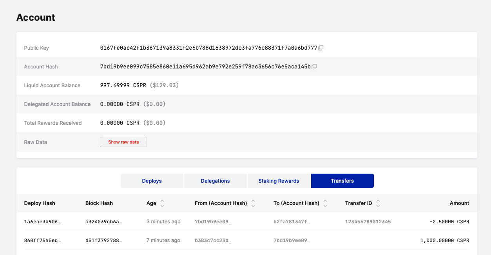

### 5. Delegating and Undelegating Tokens

Delegating 10 CSPR:

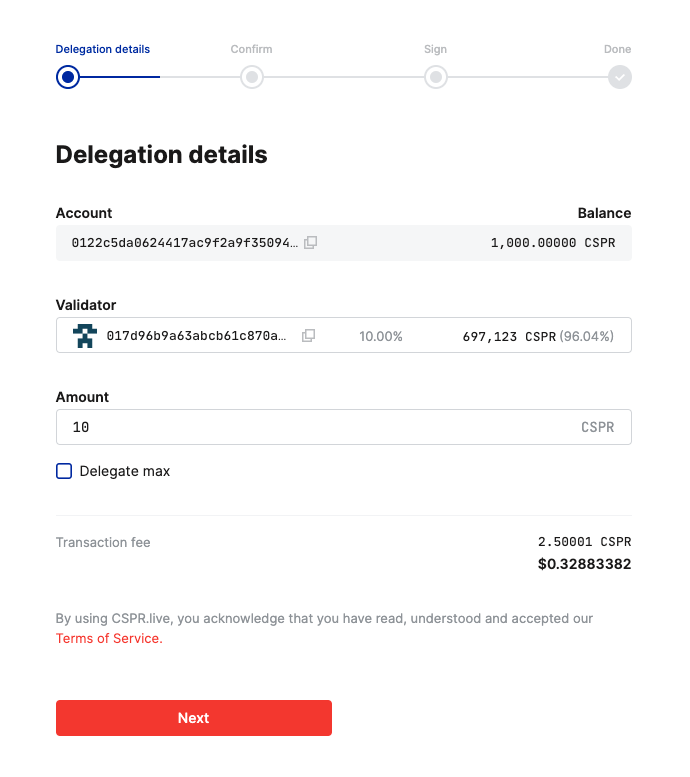

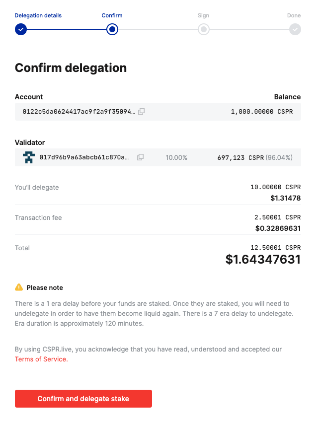

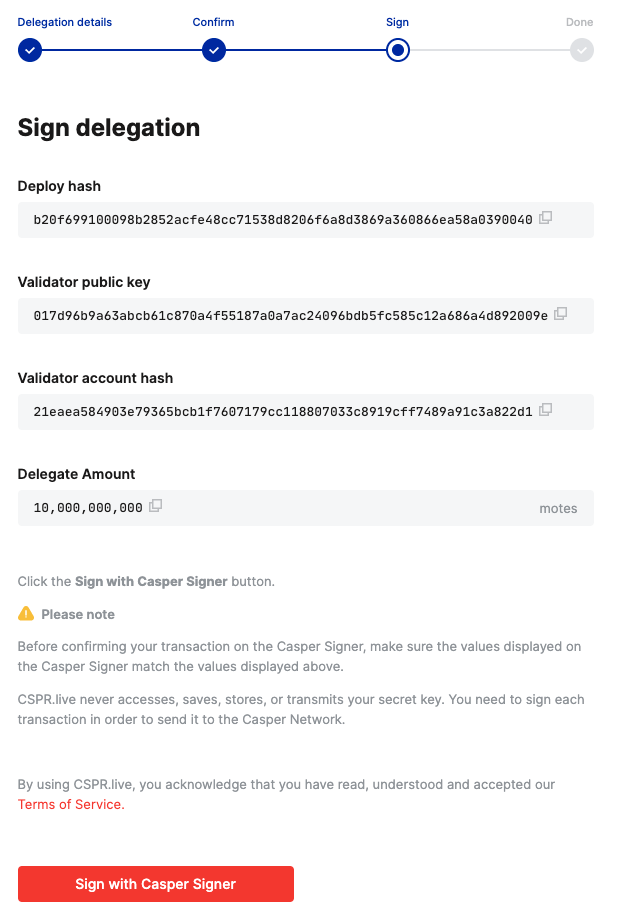

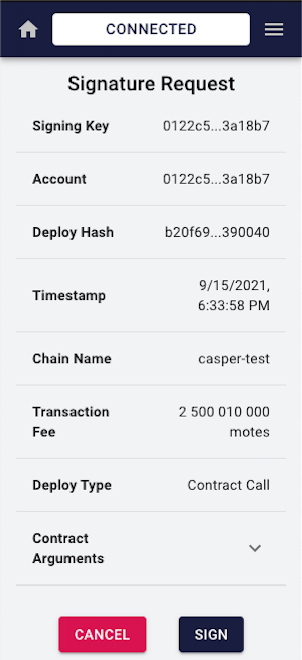

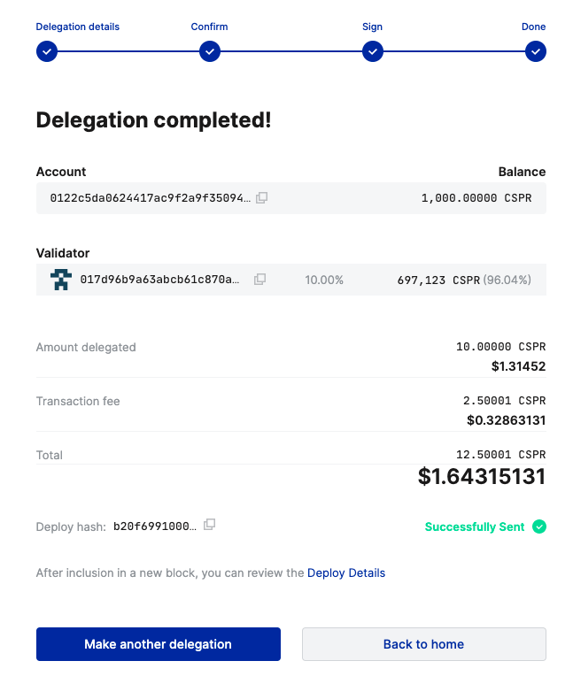

Undelegate 10 CSPR:

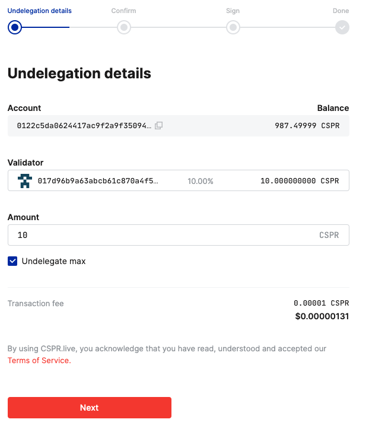

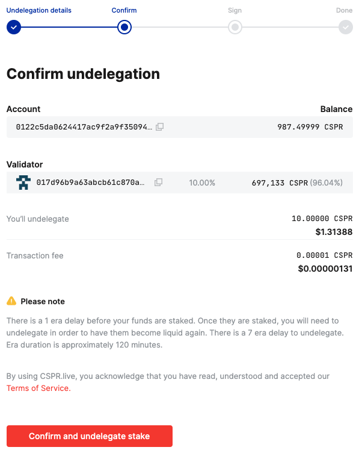

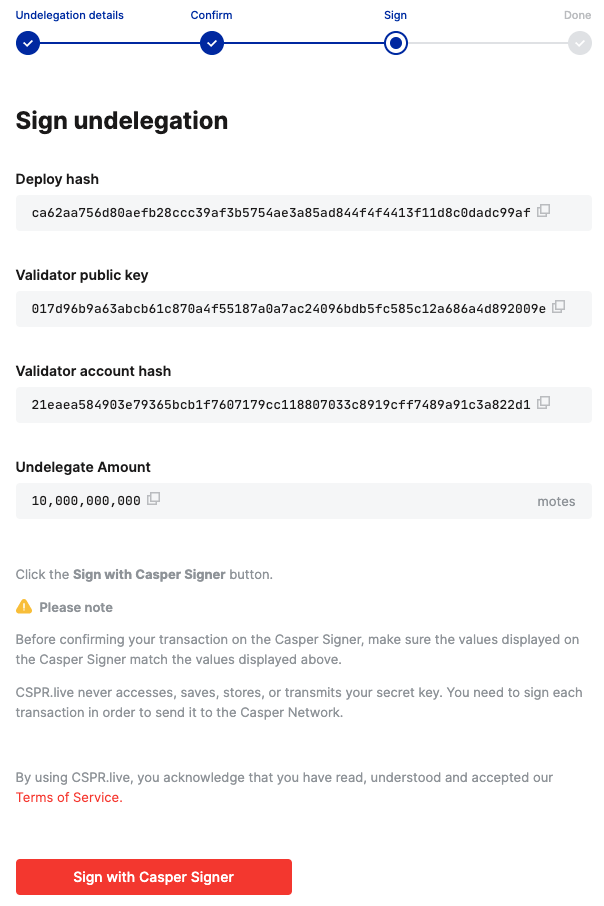

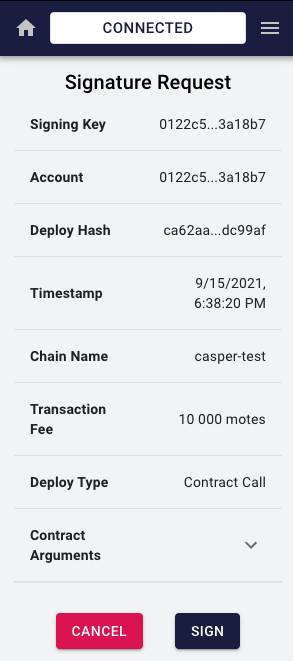

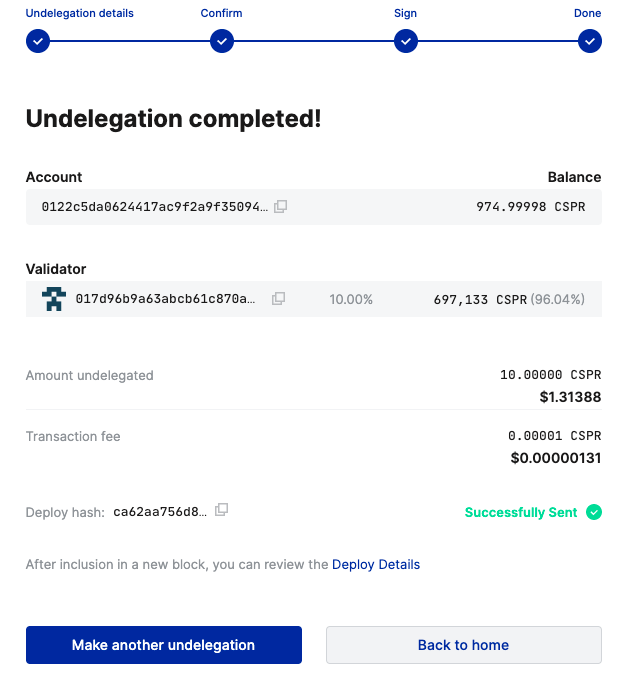
